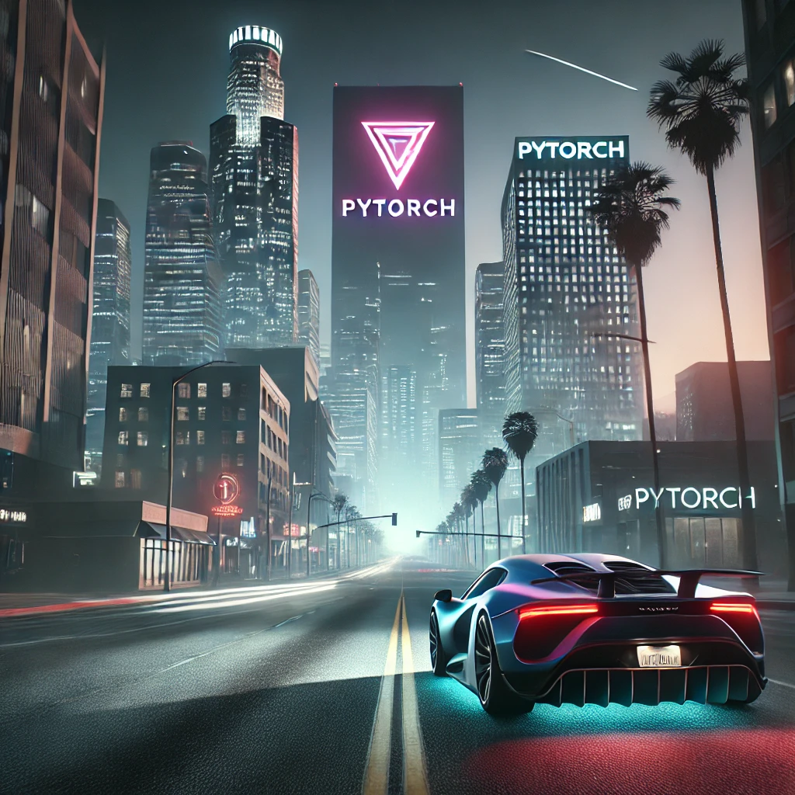

# Self-Driving Car in GTA using PyTorch , crazy right? probably not that crazy




This is a fully-featured **self-driving car program** built using **PyTorch** and **Convolutional Neural Networks (CNNs)**. The system is capable of controlling a car's movement autonomously by processing input data from the game environment.


## Installation

To set up the environment and install the necessary dependencies, run the following command:

```bash
pip install -r requirements.txt
```

Use the https://github.com/scripthookvdotnet to allow the logging script to run in order to collect output speed of the vehicle

This project requires the installation of `ScpVBus` if you intend on using the Virtual Controller object. It can be installed by following the below. 
More information can be found at [ScpVBus](https://github.com/nefarius/ScpVBus).

Open cmd.exe as administator
cd in the correct `ScpVBus-x64` directory for your arcitechture
Execute install.bat
If successful you will receive the following message

Device node created. Install is complete when drivers are installed...
Updating drivers for Root\ScpVBus from {Location}\PYXInput\ScpVBus-x64\ScpVBus.inf.
Drivers installed successfully.