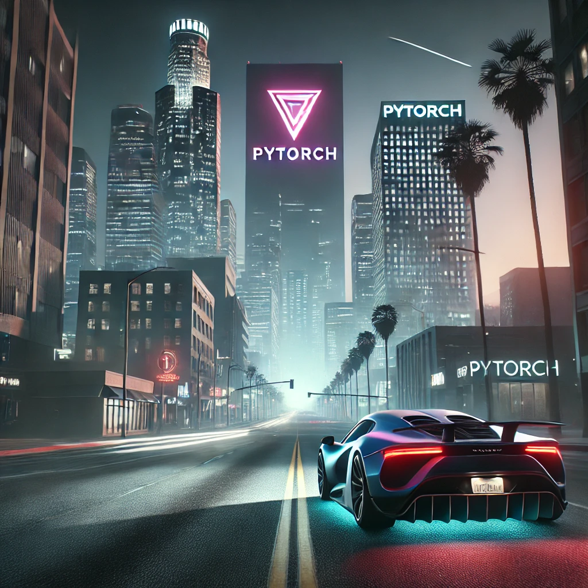
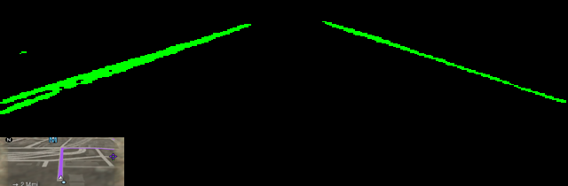

# Self-Driving Car in GTA using PyTorch , crazy right? probably not that crazy




This is a fully-featured **self-driving car program** built using **Convolutional Neural Networks** with **PyTorch**. The system is capable of controlling a car's movement autonomously by processing input data from the game environment.


## Installation

To set up the environment and install the necessary dependencies, run the following command:

```bash
pip install -r requirements.txt
```

Use the https://github.com/scripthookvdotnet to allow the logging script to run in order to collect output speed of the vehicle

This project requires the installation of `ScpVBus` if you intend on using the Virtual Controller object. It can be installed by following the below. 
More information can be found at [ScpVBus](https://github.com/nefarius/ScpVBus).

Along with the development of the https://github.com/DreadPirate09/Semantic-Segmentation-For-Road-Detection, we can use now just the features of the lane marks + the minimap for a more accurate control of the car inside the road lanes.
We have now a script that will prepare the datasets extracting the lane marks using the pretrained u-net model after which we will train our base model.

Here is a sample from the new dataset of images

<p align="center">
  
</p>

The demo can be seen here https://www.youtube.com/watch?v=FZPI0VHArDQ&ab_channel=GeorgianDanciu

<p align="center">
  
</p>
